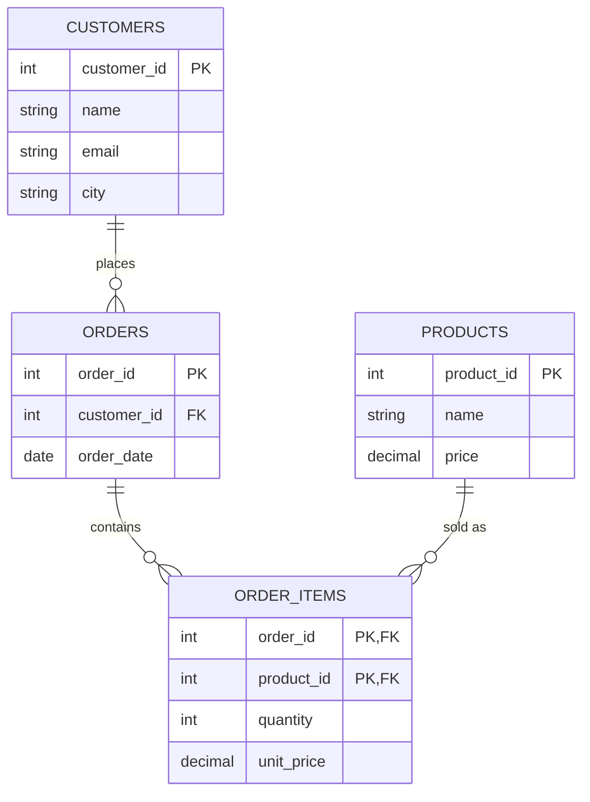

← [2.11 User & Permission Management](11-user-permission-management.md)

# 2.12 Normalization

Imagine Alice buys an iPhone and AirPods from our Apple Store. A few days
later, she buys an iPad and a Mac Mini. Where should we store her email:
beside every item she bought, beside every order, or once in her customer record?

That is the kind of question **normalization** helps us answer.

## What is normalization?

**Normalization means organizing data into related tables so that each
fact is stored with the thing it describes.**

| Fact | What does it describe? | Where should it live? |
|---|---|---|
| Alice's current email | A customer | `customers` |
| The date order 1 was placed | An order | `orders` |
| The name of product 7 | A product | `products` |
| How many of product 7 were bought in order 1 | A product within a particular order | `order_items` |

The tables connect through IDs. An order stores `customer_id` so we can
find its customer without copying their name, email, and city into every order.

## Why do we need it?

### One big table is easy to start with

Suppose we record one row per purchased product:

| order_id | customer_name | customer_email | customer_city | product_name | quantity | order_date |
|---|---|---|---|---|---|---|
| 1 | Alice Chen | alice@mail.com | New York | iPhone 17 Pro | 1 | 2026-03-01 |
| 1 | Alice Chen | alice@mail.com | New York | AirPods Max | 1 | 2026-03-01 |
| 2 | Bob Diaz | bob@mail.com | Los Angeles | MacBook Air | 1 | 2026-03-02 |
| 3 | Alice Chen | alice@mail.com | New York | iPad Pro | 1 | 2026-03-05 |
| 3 | Alice Chen | alice@mail.com | New York | Mac Mini | 1 | 2026-03-05 |

Alice's contact details appear **four times**. The date of order 1 appears
twice because it contains two products.

### Three ordinary actions expose the problem

| Action | What goes wrong? | Name for the problem |
|---|---|---|
| Alice changes her email | Update four rows. Miss one, and we have conflicting emails for Alice. | **Update anomaly** |
| Carla registers without placing an order | We cannot record her without inventing an order or leaving the purchase fields empty. | **Insertion anomaly** |
| We remove Bob's only order | We also lose his customer details because they existed only in that order's row. | **Deletion anomaly** |

An **anomaly** here means an unwanted side effect of changing data.
Customer facts and purchase facts are tied together when they should be
able to exist independently.

## How do we normalize it?

We will improve the design in three stages, called **normal forms**:
1NF, 2NF, and 3NF. Each stage builds on the previous one.

### Step 1 — 1NF: give each purchased product its own row

#### ❌ Wrong example — multiple products in one cell

Before using our flat table, we might have tried putting the whole basket
into a single cell:

| order_id | products | quantities |
|---|---|---|
| 1 | iPhone 17 Pro, AirPods Max | 1, 1 |

Changing only the AirPods quantity means editing a list and keeping its
positions aligned with a second list. Searching for AirPods orders also
requires looking inside the text.

#### ✅ Right example — one row per purchased product

For this relational design, use **one value per cell and one row per
ordered product**, rather than lists or columns such as `product_1`,
`product_2`, and `product_3`:

| order_id | product_id | product_name | quantity |
|---|---|---|---|
| 1 | 1 | iPhone 17 Pro | 1 |
| 1 | 7 | AirPods Max | 1 |

**Why this works:** to change the AirPods quantity, update only the row
for order 1 and product 7. There are no text lists to split or keep aligned.
This fixes 1NF; the product name will move to its own table in Step 2.

Use product IDs because names can change. In this course, each product
appears at most once within an order; buying two means `quantity = 2`.
So **`(order_id, product_id)` together identify one line item**.
This pair is a **composite key**:

- `order_id` alone is not enough: order 1 has two products.
- `product_id` alone is not enough: product 7 can appear in many orders.
- The pair `(1, 7)` identifies the AirPods line in order 1.

Our original flat table already has one row per product. It still repeats
customer details, so reaching 1NF is only the first step.

### Step 2 — 2NF: keep facts that need the whole key together

#### ❌ Wrong example — order facts repeated on item rows

Here are the two items from order 1, with the order date copied onto both:

| order_id | product_id | order_date | product_name | quantity | unit_price |
|---|---|---|---|---|---|
| 1 | 1 | 2026-03-01 | iPhone 17 Pro | 1 | 1249.00 |
| 1 | 7 | 2026-03-01 | AirPods Max | 1 | 549.00 |

**What breaks:** suppose the date was entered incorrectly. Correcting only
the first row to March 2 leaves order 1 with two different dates. Also,
renaming AirPods Max would require finding every order row containing it.

Ask: **does this fact describe the order, the product, or their combination?**

Give our flat table `customer_id` and `product_id` columns. Also distinguish
the product's current catalog price from the price charged for a purchase:

| Fact | What identifies it? | Why? |
|---|---|---|
| Order date and customer | `order_id` | Order 1 has the same date and customer for all its products. |
| Product name and current catalog price | `product_id` | Product 7 has one current catalog entry, regardless of the order. |
| Quantity and price charged (`unit_price`) | `(order_id, product_id)` | These describe a particular product within a particular purchase. |

When one value determines another, we call that a **dependency**.
Knowing the order ID, for example, tells us the order's date.

The date depends on only **part** of our composite key: `order_id`.
That is a **partial dependency**. The product name also depends on only
part of the key: `product_id`.

**2NF requires 1NF, plus no non-key fact depending on only part of a
candidate key** (a minimal set of columns that uniquely identifies a row).
Here, the key we need to examine is `(order_id, product_id)`.

#### ✅ Right example — separate order, product, and item facts

For the same two purchased items, store the data like this. Customer
details are omitted here so we can focus on the order date and product name;
Step 3 handles those customer details.

**`orders`:**

| order_id | customer_id | order_date |
|---|---|---|
| 1 | 1 | 2026-03-01 |

**`products` — the two relevant catalog entries:**

| product_id | name | price |
|---|---|---|
| 1 | iPhone 17 Pro | 1249.00 |
| 7 | AirPods Max | 549.00 |

**`order_items`:**

| order_id | product_id | quantity | unit_price |
|---|---|---|---|
| 1 | 1 | 1 | 1249.00 |
| 1 | 7 | 1 | 549.00 |

**Why this works:** correcting the date changes one order row. Renaming
AirPods Max changes one product row. Neither change requires editing the
line items.

Including the customer details we still need to separate, our tables at
this stage are:

| Table | Columns at this stage | One row represents… |
|---|---|---|
| `orders` | `order_id`, `order_date`, `customer_id`, customer name, email, city | One order |
| `products` | `product_id`, `name`, `price` | One catalog product |
| `order_items` | `order_id`, `product_id`, `quantity`, `unit_price` | One product purchased in one order |

Now order 1's date is stored once, and product 7's name is stored once.
The line item keeps the quantity and price charged because those belong to
that particular purchase.

But Alice still has two orders. Her contact details are still copied into
both order rows. We need one more step.

### Step 3 — 3NF: move customer facts to the customer

#### ❌ Wrong example — customer details copied into every order

After Step 2, `orders` looks like this:

| order_id | order_date | customer_id | customer_name | customer_email | customer_city |
|---|---|---|---|---|---|
| 1 | 2026-03-01 | 1 | Alice Chen | alice@mail.com | New York |
| 2 | 2026-03-02 | 2 | Bob Diaz | bob@mail.com | Los Angeles |
| 3 | 2026-03-05 | 1 | Alice Chen | alice@mail.com | New York |

**What breaks:** Alice changes her email to `alice.chen@mail.com`. If we
update order 1 but forget order 3, the same customer has two conflicting
current email addresses. Her next order would introduce another copy.

**If Alice changes her email, did anything about either order change?**

No. Her current email describes Alice. We reach it through another fact
in the order row:

```text
order_id → customer_id → customer name, email, city
```

That chain is called a **transitive dependency**. In this design, 3NF
removes it by moving the customer details into `customers` and keeping
only `customer_id` in `orders`.

#### ✅ Right example — store Alice once and reference her ID

**`customers` — one row per customer:**

| customer_id | name | email | city |
|---|---|---|---|
| 1 | Alice Chen | alice@mail.com | New York |
| 2 | Bob Diaz | bob@mail.com | Los Angeles |
| 3 | Carla Ruiz | carla@mail.com | Chicago |

**`orders` — one row per order:**

| order_id | customer_id | order_date |
|---|---|---|
| 1 | 1 | 2026-03-01 |
| 2 | 2 | 2026-03-02 |
| 3 | 1 | 2026-03-05 |

Alice's email now appears once. Her ID appears twice in `orders` because
she placed two orders. **Repeating an ID to connect records is expected**:
we can change her email without changing those connections.

**Why this works:** change Alice's email in customer row 1 once. Both
orders still lead to that same customer record, so both find the updated
email. Carla can also have an account without an order.

### Step 4 — Check the complete design

Keep the `products` table from [Lesson 2.2](02-your-first-database-apple-example.md).
Our five purchases belong in `order_items`:

| order_id | product_id | quantity | unit_price |
|---|---|---|---|
| 1 | 1 | 1 | 1249.00 |
| 1 | 7 | 1 | 549.00 |
| 2 | 2 | 1 | 989.10 |
| 3 | 5 | 1 | 999.00 |
| 3 | 10 | 1 | 599.00 |

These four tables connect like this:



`PK` means primary key; `FK` means foreign key, a reference to another
table. In `order_items`, the two marked columns form one composite primary
key. The diagram shows only the product columns relevant to this lesson.

To read order 1, follow its `customer_id` to Alice, find its two line
items, and follow their `product_id` values to the product names.
We have kept the information and changed where it lives. A `JOIN` combines
it again for a report; [Lesson 2.14](14-joins.md) teaches that.

### Why keep `unit_price` when products already have `price`?

They describe **different facts**:

- `products.price`: what the product costs in the catalog now.
- `order_items.unit_price`: what one unit cost in this particular purchase.

Suppose AirPods Max cost 549.00 when Alice bought them, and later the store
changes the catalog price to 499.00. Her old order must still show 549.00.
Using today's catalog price would incorrectly change her purchase history.

The values can initially match without being redundant facts. Keeping the
purchase price is compatible with normalization: it belongs to the line item.
Similarly, customer city here is a **current profile detail**; a shipping
address recorded for an old order would be a separate historical fact.

## Did we solve the original problems?

| Action | With the normalized design |
|---|---|
| Alice changes her email | Update one row in `customers`; both orders still reference her. |
| Carla registers without buying anything | Insert one row into `customers`; no order is needed. |
| Bob's only order is removed | Remove its line items and the order; Bob's customer record and the products remain. |

The design lets us change these facts independently. Foreign keys, covered
in the next lesson, enforce that references point to real records.

## Quick practice: where does each fact belong?

1. Alice changes her current city to Boston.
2. Order 3 was placed on March 5.
3. The store renames product 7.
4. A customer buys two units of product 7 in one order.

<details>
<summary>Show answer</summary>

1. `customers.city` — a fact about Alice.
2. `orders.order_date` — a fact about the order.
3. `products.name` — a fact about the product.
4. `order_items.quantity` — a fact about that product within that order.

</details>

## Recap

| Form | Question to ask in this example | Change we made |
|---|---|---|
| 1NF | Are we packing multiple purchased products into one cell? | Give each ordered product its own row. |
| 2NF | Does this fact need the whole `(order_id, product_id)` key? | Move order facts to `orders` and product facts to `products`. |
| 3NF | Are we keeping customer details inside an order? | Move those details to `customers` and reference the customer by ID. |

When designing a table, first finish this sentence: **“One row represents…”**
Then check whether each column describes that thing.

[Lesson 2.13](13-relationships-and-foreign-keys.md) turns this design into
real `CREATE TABLE` statements and connects the tables with foreign keys.

---
← [2.11 User & Permission Management](11-user-permission-management.md) | Next: [2.13 Relationships & Foreign Keys →](13-relationships-and-foreign-keys.md)
