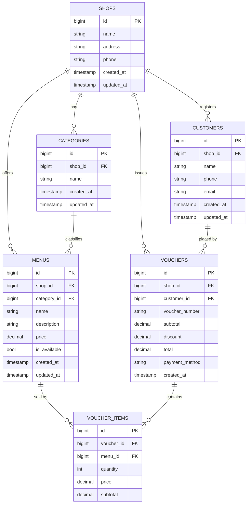

# Coffee-Shop Database Diagram

This entity-relationship diagram shows how shops, menu items, customers,
and sales are connected. A voucher may belong to a registered customer or
represent a walk-in sale with no customer record.

