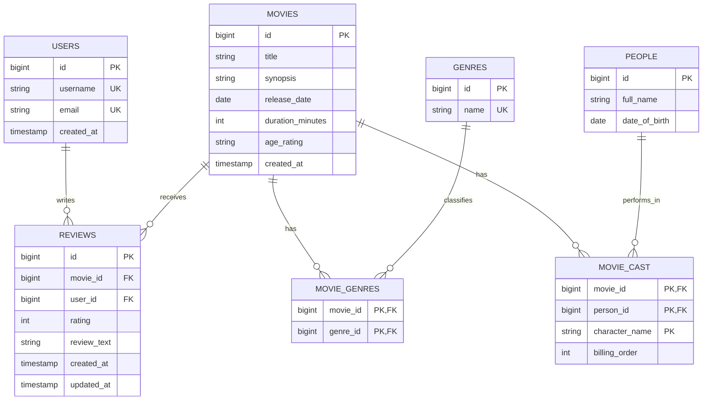

# Movie Website Database Diagram

This entity-relationship diagram models a movie catalog. Users review movies,
while junction tables connect each movie to multiple genres and cast members.

```mermaid
erDiagram
    USERS ||--o{ REVIEWS : writes
    MOVIES ||--o{ REVIEWS : receives
    MOVIES ||--o{ MOVIE_GENRES : has
    GENRES ||--o{ MOVIE_GENRES : classifies
    MOVIES ||--o{ MOVIE_CAST : has
    PEOPLE ||--o{ MOVIE_CAST : performs_in

    USERS {
        bigint id PK
        string username UK
        string email UK
        timestamp created_at
    }
    MOVIES {
        bigint id PK
        string title
        string synopsis
        date release_date
        int duration_minutes
        string age_rating
        timestamp created_at
    }
    GENRES {
        bigint id PK
        string name UK
    }
    MOVIE_GENRES {
        bigint movie_id PK, FK
        bigint genre_id PK, FK
    }
    PEOPLE {
        bigint id PK
        string full_name
        date date_of_birth
    }
    MOVIE_CAST {
        bigint movie_id PK, FK
        bigint person_id PK, FK
        string character_name PK
        int billing_order
    }
    REVIEWS {
        bigint id PK
        bigint movie_id FK
        bigint user_id FK
        int rating
        string review_text
        timestamp created_at
        timestamp updated_at
    }
```
