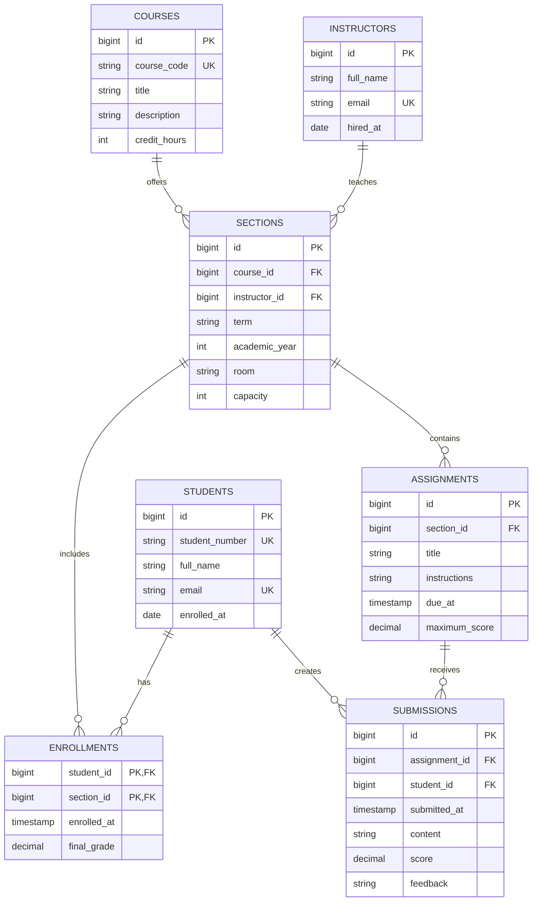

# Education Database Diagram

This entity-relationship diagram models courses, class sections, enrollments,
assignments, and student submissions. Enrollments connect students to sections,
allowing each student to take many classes.

