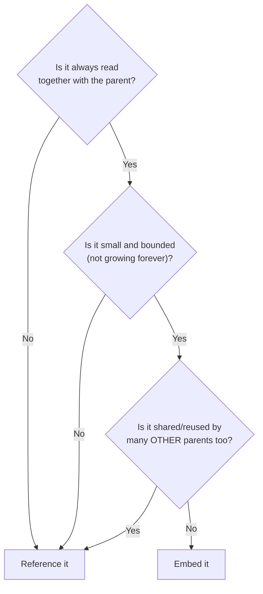
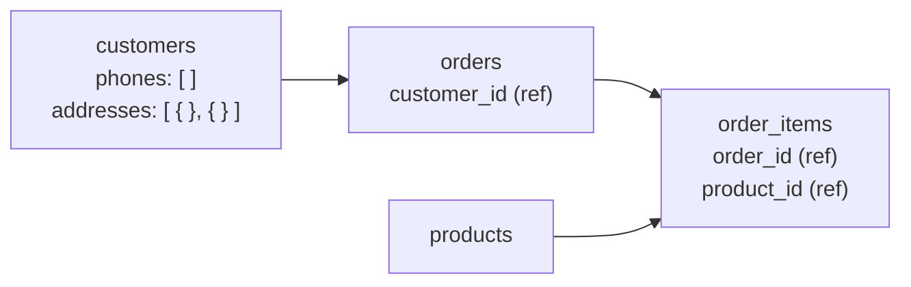

← [3.12 The `$group` Stage](12-group-stage.md)

# 3.13 Embedding vs. Referencing

[Lesson 2.9](../02-sql/12-normalization.md) split one flat table into 4,
specifically to eliminate 3 anomalies. MongoDB doesn't force that split —
but that doesn't mean the anomalies are gone. This lesson is about knowing
exactly when nesting data is safe, and when it silently reintroduces the
same problems.

## Step 1 — Remember the flat table's problem

[Lesson 2.9](../02-sql/12-normalization.md)'s flat table repeated Alice's
name/email/city on every line item she ordered — change her email, and you'd
need to update it in 4 places. That's not a SQL-specific problem; it's a
**data modeling** problem. Nest the wrong thing in MongoDB, and you get the
exact same anomaly, just inside a document instead of a table.

## Step 2 — MongoDB's actual answer: decide, deliberately, field by field

MongoDB doesn't have one universal rule like "always normalize to 3NF." You
choose, for each relationship, between:

- **Embedding** — nest the related data directly inside the parent document.
- **Referencing** — store just an ID, and look the related document up
  separately (MongoDB's version of a foreign key, but never enforced by the
  database itself — see [3.14](14-relationships-in-mongodb.md)).

## Step 3 — Embedding, done safely: customer contact details

```js
{
  _id: 1,
  name: "Alice Chen",
  email: "alice@mail.com",
  phones: ["+1-212-555-0101", "+1-212-555-0199"],
  addresses: [
    { type: "home", street: "10 Main St", city: "New York", country: "US" },
    { type: "work", street: "20 Park Ave", city: "New York", country: "US" }
  ]
}
```

Phone numbers and addresses belong to the customer, are normally read with
the customer, and stay small and bounded. `phones` is an array of strings;
`addresses` is an array of embedded documents, so each address keeps its
type, street, city, and country together.

```js
db.customers.find({
  addresses: { $elemMatch: { type: "home", city: "New York" } }
});
```

Use `$elemMatch` when the conditions must match the same address object.

## Step 4 — Referencing, done deliberately: orders and products

```js
{
  _id: 1,
  customer_id: 1,     // reference to a customer
  order_date: ISODate("2026-03-01"),
  status: "paid"
}
```

Orders reference their customer, and each `order_items` document references
one order and one product. This keeps customer details, products, orders, and
line items in their own collections. For example, changing Alice's email or a
product's name happens in one document rather than in every order that used it.

```js
db.customers.insertMany([
  { _id: 1, name: "Alice Chen", email: "alice@mail.com", city: "New York" },
  { _id: 2, name: "Bob Diaz",   email: "bob@mail.com",   city: "Los Angeles" },
  { _id: 3, name: "Carla Ruiz", email: "carla@mail.com", city: "Chicago" }
]);
```

## Step 5 — The decision rule



| Question | Customer phones and addresses | Customer, products, and order items |
|---|---|---|
| Always read together with parent? | Yes | Yes, but... |
| Small and bounded? | Yes | Yes, but... |
| Shared/reused by many other parents? | No — they belong to one customer | **Yes** — each is used across related documents |
| **Decision** | **Embed** | **Reference** |

## Step 6 — Our full schema, in MongoDB



- `customers` — embeds its own `phones` and `addresses`; referenced by
  `orders.customer_id`.
- `orders` — references its customer.
- `order_items` — references both `orders` and `products`.
- `products` — its own collection, reused by many order items.

## Step 7 — Recap

| | SQL ([Lesson 2.9](../02-sql/12-normalization.md)) | MongoDB |
|---|---|---|
| Default | Always split into normalized tables | Choose per relationship |
| Line items | Separate `order_items` table | Separate `order_items` collection with references |
| Customer contact details | Separate `customers` table | Embedded `phones` and `addresses` |
| Rule of thumb | "The key, the whole key, and nothing but the key" | "Embed what's always-together, bounded, and unshared; reference everything else" |

---
← [3.12 The `$group` Stage](12-group-stage.md) | Next: [3.14 Relationships in MongoDB →](14-relationships-in-mongodb.md)
