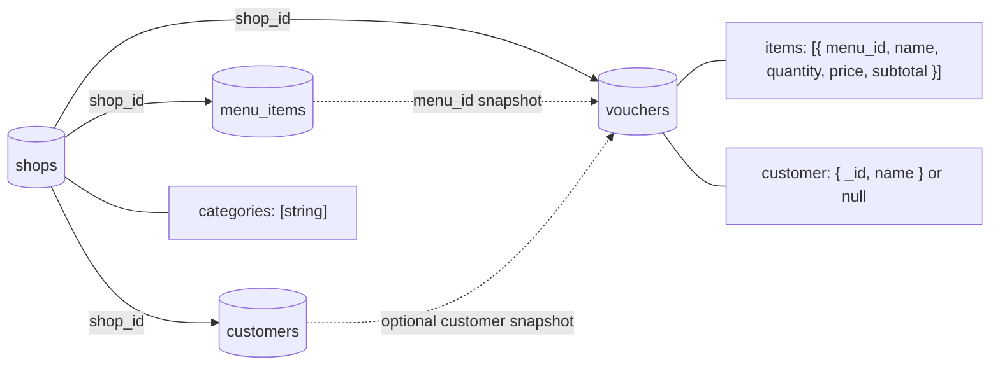

# Coffee-Shop Document Model

This model embeds categories inside the shop and line-item snapshots inside
each voucher. Menu items and customers remain separate because they are
updated and searched independently.

## Collections

| Collection | Important design choice |
|---|---|
| `shops` | Embeds its small category list |
| `menu_items` | Separate because availability and prices change |
| `customers` | Separate because customers are reused across sales |
| `vouchers` | Embeds purchased-item and customer snapshots for historical accuracy |

Run [27-coffeeshop.js](27-coffeeshop.js) in `mongosh` to create the example.

---
Next example: [Social Media →](30-social-media-diagram.md)
