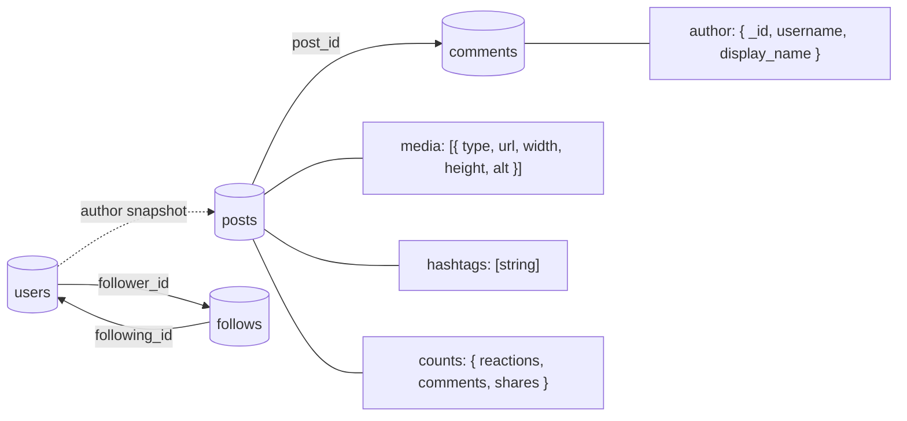

# Social-Media Document Model

Posts embed author and media data needed by the feed. Comments and follow
relationships remain separate because both can grow without limit.

| Collection | Important design choice |
|---|---|
| `users` | Canonical profiles, settings, and unique usernames |
| `posts` | Feed-ready author snapshots, media, hashtags, and counters |
| `comments` | Separate threaded content that can grow without limit |
| `follows` | Separate many-to-many relationship between users |

Run [29-social-media.js](29-social-media.js) in `mongosh` to create the example.

---
← [Coffee Shop](28-coffeeshop-diagram.md) | Next example: [IoT Monitoring →](32-iot-monitoring-diagram.md)
