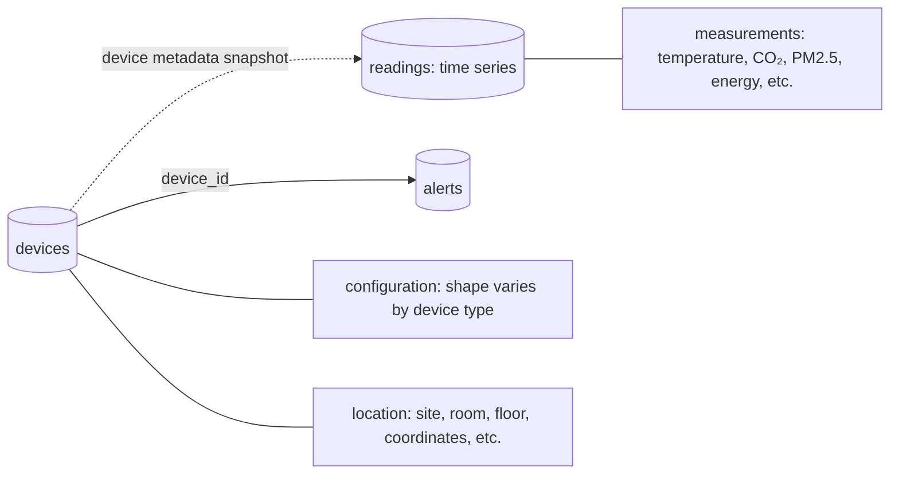

# IoT Monitoring Document Model

Devices use flexible configuration and location objects because each device
type has different settings. High-volume measurements use a time-series
collection, while actionable alerts remain in a normal collection.

| Collection | Important design choice |
|---|---|
| `devices` | Flexible configuration and location shapes |
| `readings` | Time-series collection with automatic 90-day expiration |
| `alerts` | Independently queried operational events referencing devices |

Run [31-iot-monitoring.js](31-iot-monitoring.js) in `mongosh` to create the example.

---
← [Social Media](30-social-media-diagram.md) | Next: [Chapter 4 — Comparison →](../04-comparison/01-same-data-two-ways.md)
