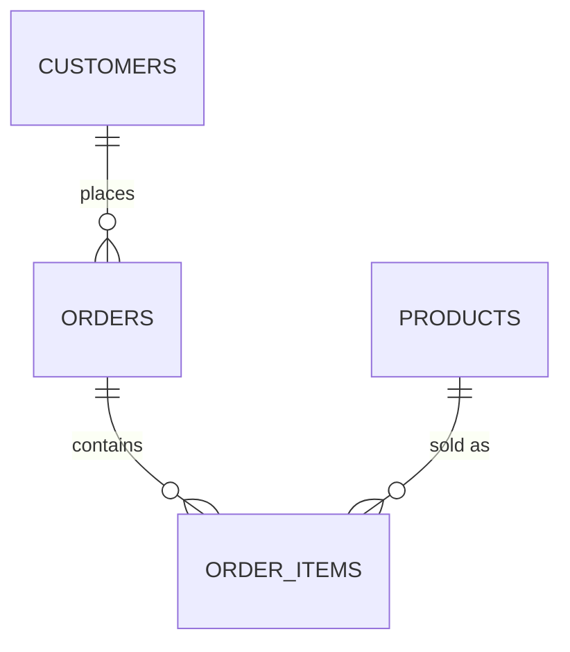
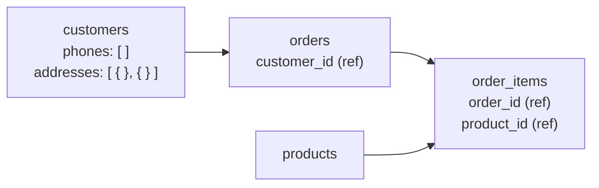

← [3.24 Document Databases Conclusion](../03-document-db/24-conclusion.md)

# 4.1 The Same Data, Two Ways

Same `apple_store` data throughout Parts 1 and 2, on purpose — so this
comparison is never abstract. Let's look at both shapes side by side.

## The relational shape (Part 1)



4 tables. `order_items` exists purely because SQL tables can't nest a list
— [Lesson 2.12](../02-sql/12-normalization.md) required it, not chose it.

```sql
-- customers
{ customer_id: 1, name: "Alice Chen", email: "alice@mail.com", city: "New York" }

-- orders
{ order_id: 1, customer_id: 1, order_date: '2026-03-01' }

-- order_items (a SEPARATE table)
{ order_id: 1, product_id: 1, quantity: 1, unit_price: 1249.00 }
{ order_id: 1, product_id: 7, quantity: 1, unit_price: 549.00 }
```

Reconstructing "order 1, with everything in it" means a `JOIN` across 3
tables ([Lesson 2.14](../02-sql/14-joins.md)).

## The document shape (Part 2)



4 collections. [3.13](../03-document-db/13-embedding-vs-referencing.md)
embeds only a customer's phone numbers and addresses; the other store
relationships use references.

```js
// customers — contact details are embedded with their customer
{ _id: 1, name: "Alice Chen", email: "alice@mail.com",
  phones: ["+1-212-555-0101", "+1-212-555-0199"],
  addresses: [ { type: "home", city: "New York" }, { type: "work", city: "New York" } ] }

// orders and order_items — both use references
{ _id: 1, customer_id: 1, order_date: ISODate("2026-03-01"), status: "paid" }
{ _id: 1, order_id: 1, product_id: 1, quantity: 1, unit_price: 1249.00 }
{ _id: 2, order_id: 1, product_id: 7, quantity: 1, unit_price: 549.00 }
```

Reconstructing "order 1, with everything in it" needs lookups from `orders`
to `customers`, `order_items`, and `products`.

## Side by side

| | SQL (Part 1) | MongoDB (Part 2) |
|---|---|---|
| Collections/tables | 4 (`customers`, `orders`, `order_items`, `products`) | 4 (`customers`, `orders`, `order_items`, `products`) |
| Line items | Separate table, required | Separate collection with references |
| Fetch one full order | Requires a `JOIN` | Requires `$lookup` stages |
| Add a new order field | `ALTER TABLE` | Just start writing it — no migration |
| Guarantee every order has a real customer | Enforced (`FOREIGN KEY`) | **Not enforced** ([3.14](../03-document-db/14-relationships-in-mongodb.md)) |
| Guarantee `order_items` never duplicates a product per order | Enforced (composite `PRIMARY KEY`) | Only if you add that check yourself |

## The pattern to notice

Neither shape is "the data" — both are **decisions** about how to organize
the exact same facts. SQL's shape came from normalization rules applied
uniformly; MongoDB's shape came from asking "what's read together?" for each
relationship, one at a time. [Lesson 4.2](02-same-query-two-ways.md) shows
what querying each shape actually feels like.

---
← [3.24 Document Databases Conclusion](../03-document-db/24-conclusion.md) | Next: [4.2 The Same Query, Two Ways →](02-same-query-two-ways.md)
